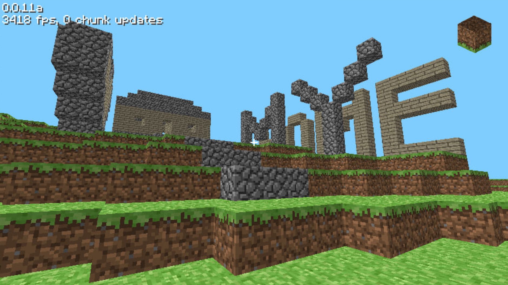

# 🧊 ReplaceCraft

> **Minecraft Classic, переписанный на Java 1.8 (SE) с OpenGL 1.1 с помощью нейросетей.**

[](https://www.oracle.com/java/technologies/javase/javase8-archive-downloads.html)
[](https://www.opengl.org/)
[](LICENSE)



## Особенности

- **Открытый исходный код** — открывает возможности для изучения и модификации.
- **Сохранение миров** — клавиша F5 позволяет сохранить постройки в файл формата `.rc`.
- **Читерские способности** — режимы NoClip и Fly для удобного осмотра построек.
- **Мультиплеер** — базовые функции для игры с друзьями (работает нестабильно, безопасность не гарантируется, играйте на свой страх и риск).
- **Оптимизация** — выдает показатели производительности, сравнимые с оригинальным клиентом Minecraft Classic.

---
## ✅ Главные изменения: (rc-0.2)
- **Переработана меню настроек**
- **Мягкое освещение (её можно отключить в настройках)**
- **Discord RPC (его можно отключить в настройках) **
- **Debug Меню переработан**
- **ПОЛНОЕ ИЗМЕНИЕ РАБОТЫ ПОДКЛЮЧЕНИЕ И ПАКЕТОВ МУЛЬТИПЛЕЕРА**
- **Протокол клиента**
- **Таб сервера**
- **Отключение от сервера (костыль, если выйти из сервера или просто нажать f11, то закрывается клиент, это нормально)**
- **Поддержка цветовых кодов**
- **Удалена поддержка кирилицы в чате**
- **Работа никнеймов (частичная, возможно доработки в будущем)**
- **Баг фиксы -->**
---

## ✳️ В разработке (WIP):
- **Система профилей**
- **Система скинов**
- **Главное меню игры**
- **Режимы игры (Наблюдатель, Творческий и т. д.)**
- **Новые блоки (шерсть, стекло, ступеньки, гравий, песок и т. д.)**
- **Эффект тумана**
- **Консольные команды**
- **Животные (в планах)**
- **Динамические жидкости (вода и лава)**
- **LAN-сервер для игры по локальной сети**
- **Разнообразная генерация миров и её настройка**
- **Полная поддержка русского языка**
- **Собственный лаунчер (возможно, в виде отдельного проекта)**
- **Бесконечный мир (экспериментальная функция)**
---

## Управление

- **WASD** — Передвижение
- **ЛКМ** — Разрушить блок
- **РКМ** — Установить блок
- **1–8** — Выбор блока на панели быстрого доступа
- **E** — Открыть инвентарь
- **` (тильда)** — Меню отладки (Debug Menu)
- **F1** — Режим полета (Fly)
- **F2** — Режим прохода сквозь стены (NoClip)
- **F3** — Полноэкранный режим
- **F4** — Настройки (В ТЕСТИРОВАНИИ)
- **F5** — Сохранить мир
- **F7** — Спавн мобов
- **F9** — Загрузить сохраненный мир
- **F10** — Подключиться к серверу
- **F11** — Отключиться от сервера

---

## Запуск

### Требования
- Java 8 (JRE/JDK)
- LWJGL 2.9.3
- Видеокарта или встройка с поддержкой OpenGL 1.1 и выше

### Сборка и запуск
1. Клонируйте репозиторий.
2. Загрузите LWJGL 2.9.3 с сайта [legacy.lwjgl.org](https://legacy.lwjgl.org).
3. Распакуйте файлы `lwjgl.jar`, `lwjgl_util.jar` и нативные библиотеки в папку `libs/`.
4. Откройте проект в среде разработки Eclipse.
5. Добавьте `libs/*.jar` в путь сборки (Build Path).

### Запуск клиента через консоль
```bat
java -Djava.library.path="libs/native/windows" -jar rc-0.1.jar
```

